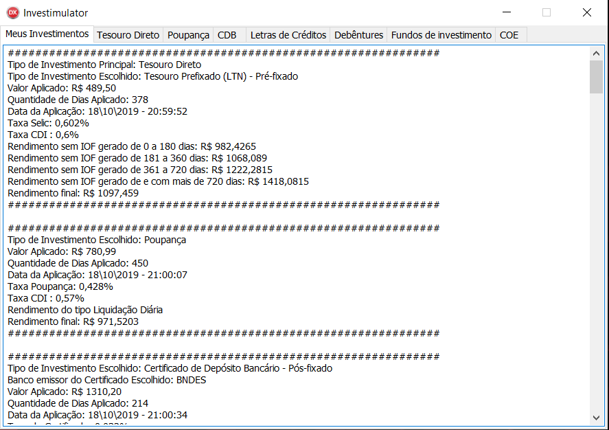
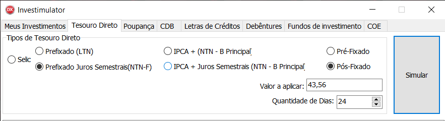
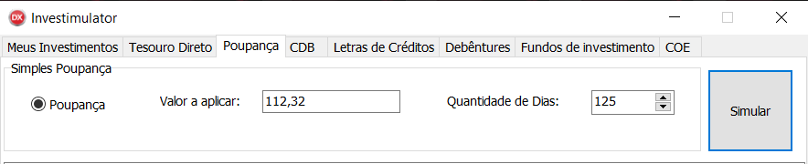
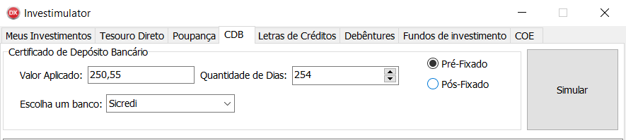
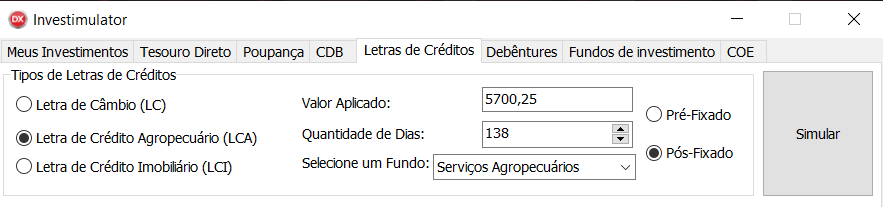
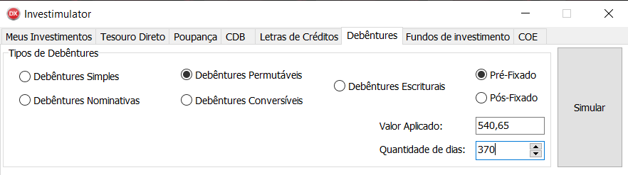
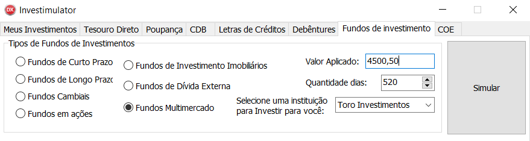
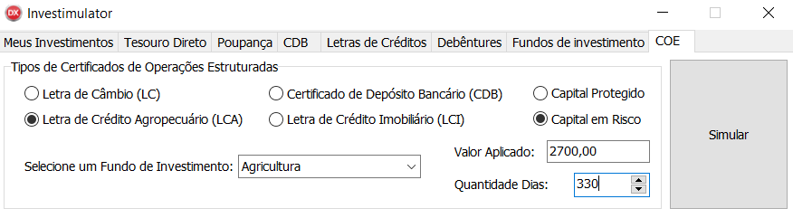

<p align="center">
  <h1 align="center">💸 Investimulator 💸</h1>
</p>

<strong>
  <p align="center">
    <a href="#-software">Software</a> |
    <a href="#-functionalities">Functionalities</a> |
    <a href="#-technologies">Technologies</a> |
    <a href="#-how-to-download-and-run">How to execute</a> | 
    <a href="#-important-links">Important links</a> | 
    <a href="#-author">Author</a> | 
    <a href="#-show-your-support">Suport</a>
  </p>
</strong>

<p>
  O Investimulator, é um sistema voltado para simulações de investimentos do tipo <b>Renda Fixa</b>, seu nome vem da junção das palavras na língua inglesa <b>Investment</b> (Investimento) com <b>Simulator</b> (Simulador).
 
  Minha ideia era que seu nome já remetesse exatamente ao seu propósito de <b>simular investimentos.</b> O aplicativo atende a todos os tópicos de investimentos dentro da modalidade de <b>Renda Fixa</b>, após a simulação ser feita, é gravado em um arquivo <b>.txt</b> mantendo um histórico.
</p>

<p align="center">
  
</p>

<p align="center">	
  

  <a href="https://github.com/edward-mn/happy-nlw/commits/master">
    
  </a> 
  
  
  
  <a href="https://github.com/edward-mn/investimulator-tcc/stargazers">
    
  </a>
  
    
    
     
</p>

---

## 👨‍💻 Software

### Visão geral 👀

<p align="center">
  
</p>

### Certificado Bancário 🏦

<p align="center">
  
</p>

---

## 🖥 Functionalities

- Tesouro Direto
<p align="center">
  
</p>

- Poupança
<p align="center">
  
</p>

- Certificado de Depósito Bancário (CDB)
<p align="center">
  
</p>

- Letras de Créditos (LC's)
<p align="center">
  
</p>

- Debêntures
<p align="center">
  
</p>

- Fundos de Ivestimentos
<p align="center">
  
</p>

- Certificados de Operações Estruturadas (COE).
<p align="center">
  
</p>

- Histórico de Investimentos 👉 [Aqui](./Investimentos)

---

## 🛠 Technologies 
- [Delphi 10 - Seattle](https://www.embarcadero.com/br/products/delphi/whats-new)
  - [VCL - Application](https://docwiki.embarcadero.com/RADStudio/Sydney/en/VCL_Forms_Application)
- [Histórico (.txt)](https://pt.wikipedia.org/wiki/Arquivo_de_texto)
 
- [Programação Orientada a Objetos - POO](https://pt.wikipedia.org/wiki/Programa%C3%A7%C3%A3o_orientada_a_objetos)
- [Linguagem de Modelagem Unificada - UML](https://pt.wikipedia.org/wiki/UML)
- [Kanban - Trello](https://pt.wikipedia.org/wiki/Kanban)
- [Singleton - Design Patter](https://pt.wikipedia.org/wiki/Singleton)
- [GIT - Release](https://docs.github.com/pt/repositories/releasing-projects-on-github/managing-releases-in-a-repository)

---

## 👷 How to [download](https://github.com/edward-mn/investimulator-tcc/archive/master.zip) and <b>run<b>
```bash
# Clone's repository
$ git clone git@github.com:edward-mn/investimulator-tcc.git
  
# Access the folder project into your Delphi IDE, then Selecting projetc group into App folder
$ ProjectGroup_Tcc.groupproj

# Complie the project and have fun 😃
```
---

## 🔗 Important links
 
<p align="center">
  
  <br>
  Documento:
  <a href="./Investimentos/Pictures/tcc_investimulator.pdf">[TCC] 📑</a>
</p>
  
> Projeto desevolvido para conclusão do curso [Ciências da Computação](https://www.fam.br/cursos/graduacao/ciencia-computacao/) na instituição [FAM - Faculdade de Americana](https://www.fam.br/) 🎓 
  
---

## 🦹‍ Author

* **Edward Moreira**
* :octocat: [@edward-mn](https://github.com/edward-mn)
* <a href="https://www.linkedin.com/in/edward-moreira-5b3056115/">
    
  </a> 
* :rocket: [Edward Moreira](https://app.rocketseat.com.br/me/edward-moreira-do-nascimento-02578)

---

## 🤝 Show your support

Give a ⭐️ if liked or helped you!

***

<strong>
  <p align="center"> This README was created with ❤️ by me </p>
</strong>
